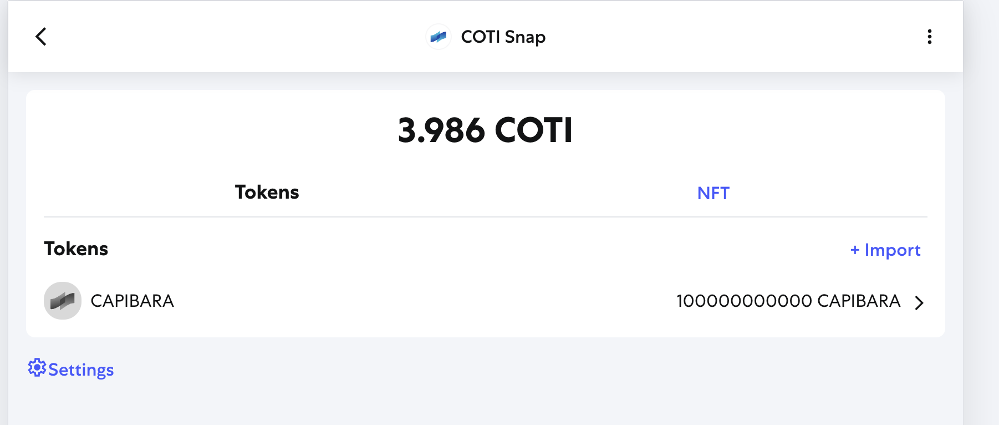

# COTI Private ERC-20 Token Development Guide

This guide demonstrates how to create, deploy, and interact with private ERC-20 tokens on the COTI network using confidential computing and AI-assisted development with Cursor.AI.

## Prerequisites

- **Node.js**: Version 22 or better installed available [here](https://nodejs.org/en/download)
- **COTI Account Onboarding**: Complete the account onboarding procedure to obtain your AES encryption key

> 📖 **For detailed instructions**, see the [official COTI onboarding guide](https://docs.coti.io/coti-documentation/build-on-coti/guides/account-onboard)

- **Cursor.AI**: For AI-assisted smart contract development available [here](https://cursor.com/downloads)

> 🔐 **Important**: Save your Private Key and AES key securely - you'll need it for all confidential operations throughout this tutorial.

## Initial Project Setup

Install dependencies in the project root directory and setup the Hardhat environment:

```bash
git clone https://github.com/plucena/coti-erc20
npm install
cd coti-hardhat-template
npm install
```

## Step 1: Create PRIVATE ERC-20 Smart Contract with Cursor.AI

Using Cursor.AI to Generate the Contract

1. **Open Cursor.AI** in your development environment
2. **Navigate** to coti-contracts/contracts/token folder
3. **Reference the required files** by mentioning them in your prompt with the `@` symbol
4. **Execute this prompt in Cursor.AI:**

```
@coti-contracts @coti-contracts/contracts/token/PrivateERC20 @coti-contracts/contracts/token/PrivateERC20.md @coti-contracts/contracts/token/IPrivateERC20.md @coti-contracts/contracts/token/PERCI.sol

Create a new contract called CAPIBARA.sol that inherits from @PrivateERC20 and has 100000 tokens
minted to 0xFFFFFFFFFFFFFFFFFFFFFF
CAPIBARA.sol must include:
- totalSupply implementation
- mint function implementation  
- transfer function implementation
- Proper inheritance from PrivateERC20
```

### Important Notes:

- **Replace the address** `0xFFFFFFFFFFFFFFFFFFFFFF` with **YOUR OWN WALLET ADDRESS**
- The `@` symbol in Cursor.AI references specific files in your workspace for context
- Cursor.AI will analyze the referenced contracts to understand the PrivateERC20 implementation pattern

## Step 2: Compile Smart Contract

Navigate to the contracts directory and compile your generated contract:

```bash
cd coti-contracts
npx hardhat compile
```

**Expected compilation output:**

```
Warning: Function state mutability can be restricted to pure
--> contracts/utils/mpc/MpcCore.sol:1043:5:
|
1043 |     function _splitUint128(uint128 number) private returns (uint64, uint64) {
|     ^ (Relevant source part starts here and spans across multiple lines).

Warning: Function state mutability can be restricted to pure
--> contracts/utils/mpc/MpcCore.sol:1500:5:
|
1500 |     function _splitUint256(uint256 number) private returns (uint128, uint128) {
|     ^ (Relevant source part starts here and spans across multiple lines).

Generating typings for: 1 artifacts in dir: typechain-types for target: ethers-v6
Successfully generated 68 typings!
Compiled 1 Solidity file successfully (evm target: paris).
```

> ⚠️ **Note**: The warnings about function state mutability are expected and can be safely ignored.


## Step 3: Create Deployment Script with Cursor.AI

### Using Cursor.AI to Generate the Deployment Script


**Execute this prompt in Cursor.AI:**

```
@deploy.ts

Create a script similar to @deploy.ts to deploy @CAPIBARA.sol

The script should:
- Follow the same pattern as the referenced deploy.ts
- Deploy the CAPIBARA contract to COTI testnet
- Output the deployed contract address
- Save the scripts on the coti-contracts/scripts folder
```

### Deploy the Contract

## Step 3: Create Deployment Script with Cursor.AI

### Using Cursor.AI to Generate the Deployment Script

**Execute this prompt in Cursor.AI:**

```
@deploy.ts

Create a script similar to @coti-contracts/scripts/deploy.ts to deploy @coti-contracts/contracts/token/CAPIBARA.sol

The script should:
- Follow the same pattern as the referenced deploy.ts
- Deploy the CAPIBARA contract to COTI testnet
- Output the deployed contract address
```

### Deploy the Contract

1. After Cursor.AI generates the deployment script, go to the coti-contracts directory of your project.

2. Create a new file named .env.

3. Open the .env file and add the private key from the user you set up in the "Prerequisites" section. Format it like this:

```.env
SIGNING_KEYS=YOUR_USER_PK
PRIVATE_KEY=YOUR_USER_PK

```

Then run the script

```bash
npx hardhat run scripts/deploy-capibara.ts --network coti-testnet
```


**Expected output:**

```
CAPIBARA Token deployed to: 0xa7ca50518d4D535bBF239CcbeCCf1CF645bdB692
```

> 📝 **Important**: Save the deployed contract address - you'll need it for all subsequent operations. Your address will be different from the example above.

> 🔍 **MetaMask Integration**: Encrypted values will be visible in MetaMask, showing the confidential nature of the token balances.

## Step 4: Check the balance using the Metamask COTI Snap

You can check that the token was correctly minting by acessing the Metamask COTI Snap.  
On the tokens tab click import and enter the address of the deployed contract




## Step 5: Create Token Minting Script with Cursor.AI

### Using Cursor.AI to Generate the Minting Script

**Execute this prompt in Cursor.AI:**

```
@mint.ts @CAPIBARA.sol

Given @CAPIBARA.sol deployed at YOUR_CONTRACT_ADDRESS, write a hardhat script to call the mint function similar to @mint.ts

The script should:
- Connect to the deployed CAPIBARA contract
- Call the mint function with proper parameters
- Handle the confidential token minting process
- Display transaction details and confirmation
- Show the minted amount in both raw and formatted values
```

### Run the Minting Script

```bash
npx hardhat run scripts/mintCapibara.ts --network coti-testnet
```

**Expected output:**

```
Attempting to call mint on CAPIBARA contract at 0xa7ca50518d4D535bBF239CcbeCCf1CF645bdB692
Minting tokens to: 0xfAF7e0962B79675cd046C4c0bF41beEb27FCc5C8
Value (smallest units): 5000000000
Value (whole tokens): 5000
Using deployer account (owner and recipient for minting): 0xfAF7e0962B79675cd046C4c0bF41beEb27FCc5C8
Transaction sent: 0x7b91a7bd3f805a100951e4a89d0b9de988c280d3512ac6e94e9d8001ea8ab7e5
Transaction confirmed: 0x7b91a7bd3f805a100951e4a89d0b9de988c280d3512ac6e94e9d8001ea8ab7e5
mint called successfully! 5000 CAPI tokens (value: 5000000000) minted to 0xfAF7e0962B79675cd046C4c0bF41beEb27FCc5C8.
```

## Understanding COTI's Confidential Computing

This tutorial demonstrates COTI's unique privacy-preserving blockchain capabilities:

### Key Features:

1. **🔐 Private Token Values**: All token balances are encrypted on-chain using COTI's MPC (Multi-Party Computation) technology
2. **🔑 Selective Decryption**: Only authorized parties with correct private keys can decrypt and view actual token amounts
3. **⚙️ ERC-20 Compatibility**: Despite privacy features, maintains full ERC-20 standard compatibility
4. **🦊 MetaMask Integration**: Encrypted values are visible in MetaMask, providing transparency about encrypted data existence

## Cursor.AI Best Practices for COTI Development

### Effective Prompting Tips:

- **Use `@` References**: Always reference relevant files with `@filename` for better context
- **Be Specific**: Include exact function names and requirements in your prompts
- **Reference Patterns**: Point to existing similar files as templates
- **Security Focus**: Always ask for proper private key and AES key handling

### File References Guide:

- `@PrivateERC20.sol` - Base contract for private ERC-20 tokens
- `@IPrivateERC20.sol` - Interface definition
- `@PERCI.sol` - Example implementation reference
- `@deploy.ts` - Standard deployment script template
- `@getBalance.ts` - Balance checking script template
- `@mint.ts` - Token minting script template

## Security Checklist

- [ ]  **Never commit private keys** to version control
- [ ]  **Store AES keys securely** - required for decrypting confidential values
- [ ]  **Test on testnet first** before deploying to mainnet
- [ ]  **Verify contract addresses** before interacting with deployed contracts
- [ ]  **Use environment variables** for sensitive configuration data
- [ ]  **Validate all user inputs** in your smart contracts
- [ ]  **Test decryption functionality** with your specific keys before production use
